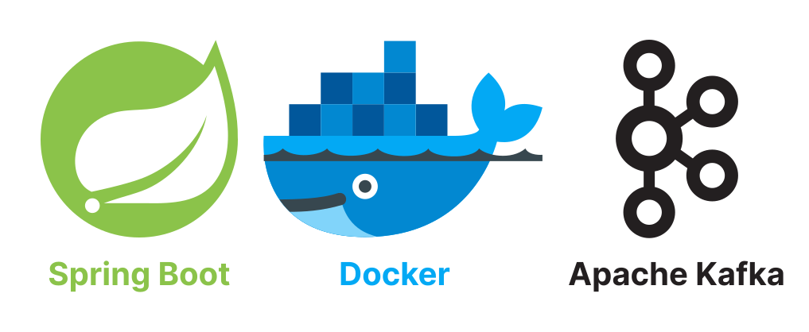
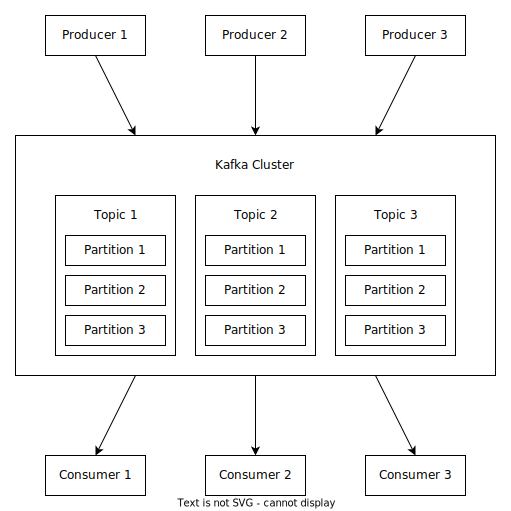

# Java Spring Boot + Apache Kafka Microservice



This repository demonstrates a minimal microservice example,
which includes the implementation of Apache Kafka and the latest version of Java Spring Boot.

# 1. How Apache Kafka Works



- **Apache Kafka:**
	- Kafka is a distributed event streaming platform that enables real-time processing large volumes of data.
- **Producers:**
	- Producers generate and send data records to topics, which serve as data channels.
- **Topics:**
	- Topics are divided into partitions, which are the fundamental unit of parallelism and scalability.
- **Partitions:**
	- Partitions are distributed across brokers within a Kafka Cluster.
- **Consumers:**
	- Consumers can read from multiple partitions in parallel, providing horizontal scalability.
- **Summary:**
	- Producers publish data to specific topics, and consumers subscribe to those topics to consume data.
	- Kafka ensures data durability, fault tolerance and high throughput, making it a reliable foundation for building
		real-time data pipelines and event-driven applications.

# 2. Start Docker Compose

First of all, run the Zookeeper and Kafka server via Docker Compose:

```shell
docker compose up -d
```

- **Note:** this has also started the `kafka-ui` server which can be opened at http://localhost:8090/.

# 3. Java Spring Boot + Apache Kafka

Check out the other repository which dives deeper into experimenting with Apache Kafka using minimal implementation:
https://github.com/MilanObrenovic/spring-boot-kafka.git
